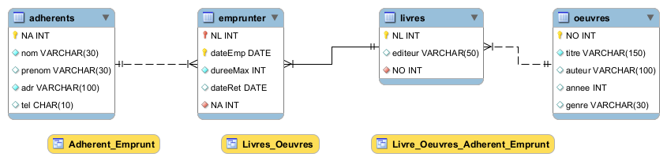

# SAYNA-EVALUATION SQL INTERMEDIARE 1

1) Biblio_base_original.sql (Biblio_base.txt): Le script original
2) Biblio_base.sql: La nouvelle scpit apres correction
3) biblio_eer.mwb : diagram EER générer avc MysqlWorkbench 
4) Evaluation.pdf : Réponses.

